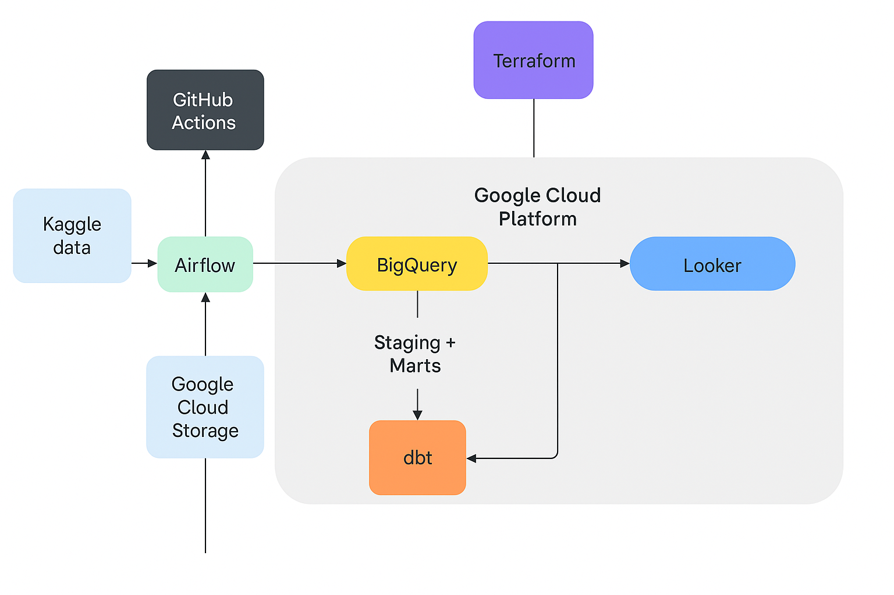
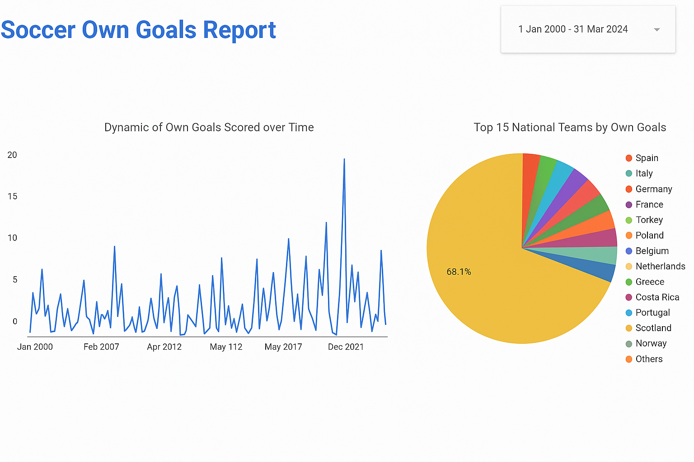

# SoccerETL Pipeline

## Problem Statement

This project implements an end-to-end data pipeline designed to **analyze historical international football** match data, with a specific focus on own goals. Leveraging a modern data stack, it automates the processes of data ingestion, transformation, and visualization using tools like Airflow, BigQuery, and dbt. The entire infrastructure is provisioned and managed through Terraform for reproducibility and scalability.

The data source used is from Kaggle [International football results from 1872 to 2017](https://www.kaggle.com/datasets/martj42/international-football-results-from-1872-to-2017). The core objective of this project is to explore the patterns and trends of own goals scored by different teams over the span of nearly 150 years.


## Architecture


#### Technology Stack

- **Workflow Orchestration** with **Docker**
- **Data Orchestration** using **Airflow**
- **Scalable Data Warehousing** with **BigQuery**
- **Data Transformation** with **data build tool (dbt)**
- **Infrastructure as Code** with **Terraform**
- **Interactive Data Visualization** using **Looker**

## Setup

### Prerequisites

Ensure you have the following installed:
- [Docker](https://www.docker.com/get-started)
- [Python 3.x](https://www.python.org/downloads/)
- [Terraform](https://www.terraform.io/downloads)
- [dbt](https://docs.getdbt.com/docs/installation)
- [Google Cloud SDK](https://cloud.google.com/sdk/docs/install) (for BigQuery access)

### 1. Clone the Repository

   ```bash
   git clone https://github.com/nik19abramov/SoccerETL-Pipeline.git
   cd SoccerETL-Pipeline
   ```

### 2. **Start the Environment with Docker**
Use the provided Docker Compose file to bring up the containerized services:

  ```bash 
  docker-compose up -d
  ```

### 3. **Provision Infrastructure with Terraform**
Navigate to the Terraform folder, initialize, and apply the configuration:

  ```bash
  cd terraform

  #initializing
  terraform init

  terraform plan

  #applying
  terraform apply
  ```

It is necessary to update `variables.tf` with corresponding:
- path to the file with your GCP credentials json 
- Project Id
- BigQuery Dataset Name
- Bucket Name


### 4. **Trigger Airflow DAGs Using the Airflow UI**

- Open your web browser and navigate to [http://localhost:8080](http://localhost:8080).
- Log in with the following credentials:  
  **Username:** `admin`  
  **Password:** `admin`
- On the Airflow UI, locate the `soccer_analytics_pipeline` DAG in the list.
- Click on the toggle to unpause the DAG if it's paused.
- Click the "Trigger DAG" button to start the pipeline.

### 5. **Deploy dbt Models**

Run the dbt models to transform and prepare your data:

   ```bash
   cd data-transformation
   dbt build
   dbt run
   ```

### 6. **View the Looker Dashboard**
Access the Looker dashboard by navigating to the [link](https://lookerstudio.google.com/reporting/ecfaa9f4-3feb-4fd7-9c2c-92bc4bc29f64)


